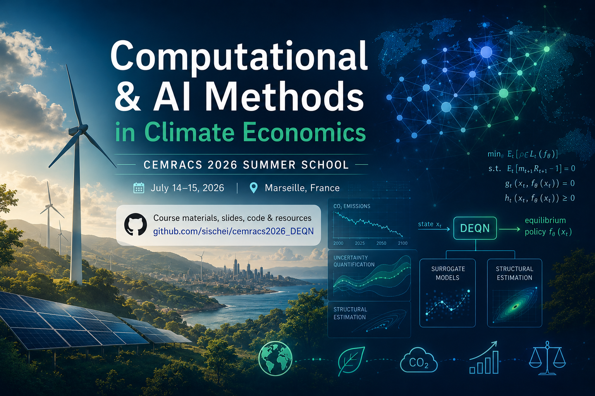

# Computational and AI Methods in Climate Economics
*(CEMRACS 2026 Summer School — "Modeling and AI for Environmental Transition", July 14–15, 2026)*

<p align="center">
  
</p>

This mini-course introduces **computational and AI methods for climate
economics** to the participants of the
[CEMRACS 2026](https://cemracs2026.math.cnrs.fr/en/) summer school. Over three
lectures it builds a modern deep-learning toolkit for solving, estimating, and
performing uncertainty quantification on high-dimensional dynamic economic
models — with a running application to climate–economy integrated assessment
models (IAMs) and optimal carbon taxation.

The course is delivered as **three lectures** (Parts I–III) paired with two
hands-on **practical sessions** taught by Maria Pia Lombardo.

> **Companion textbook treatment.** This mini-course is a focused, climate-economics-oriented
> excerpt of a much broader body of material. For a thorough, textbook-style
> treatment of deep learning for **solving and estimating dynamic economic and
> financial models** — with full lecture notes, slides, and runnable code — see the
> companion repository
> [**Deep Learning for Solving and Estimating Dynamic Economic Models**](https://github.com/sischei/Deep_Learning_for_Solving_And_Estimating_Dynamic_Economic_Models).

## Quick Links

- [Quick Start](#quick-start)
- [Detailed Timetable](#detailed-timetable)
- [Course Overview](#course-overview)
- [Materials by Lecture](#materials-by-lecture)
- [References](#references)
- [Citation](#citation)
- [Lecturer](#lecturer)
- [License](#license)
- [Going further](#going-further)

## Quick Start

### Prerequisites

- Basic economics and econometrics
- Familiarity with Python programming (please look at this
  [Python refresher](python_refresher), or at the more comprehensive course on
  [QuantEcon Python Programming](https://python-programming.quantecon.org/intro.html))
- Solid understanding of basic calculus and probability (see
  [Mathematics for Machine Learning](https://mml-book.github.io/))

### Local Setup

All notebooks run on **Python 3.10+**. The main dependencies are:

| Package | Purpose |
|---------|---------|
| [NumPy](https://numpy.org/) | Numerical computing |
| [SciPy](https://scipy.org/) | Scientific computing |
| [Pandas](https://pandas.pydata.org/) | Data analysis |
| [Matplotlib](https://matplotlib.org/) | Visualization |
| [scikit-learn](https://scikit-learn.org/) | Classical machine learning & Gaussian processes |
| [TensorFlow](https://www.tensorflow.org/) >= 2.15 | Deep learning (DEQNs, surrogates) |
| [TensorFlow Probability](https://www.tensorflow.org/probability) | Gaussian processes & deep UQ |
| [TensorBoard](https://www.tensorflow.org/tensorboard) | Training monitoring |
| [PyTorch](https://pytorch.org/) >= 2.0 | Deep learning (selected notebooks, optional) |

A [`requirements.txt`](requirements.txt) covering the notebooks of all three
lectures is provided in the repository root. To install everything at once, we
recommend a fresh virtual environment:

```bash
# create and activate a virtual environment (Python 3.10–3.12)
python -m venv .venv
source .venv/bin/activate        # on Windows: .venv\Scripts\activate

# install all course dependencies with pip
pip install -r requirements.txt
```

### Course Platform

- Lecture materials (slides, code, readings) are available via this
  [GitHub repository](https://github.com/sischei/cemracs2026_DEQN) and on
  [**Nuvolos Cloud**](https://nuvolos.cloud/).
- To enroll in this class, please click on the
  [**enrollment link**](https://app.eu1.nuvolos.cloud/enroll/class/YXzUpFuVss8)
  and follow the steps.
- All required software and dependencies are pre-installed on the platform.
- Nuvolos support: <support@nuvolos.cloud>

## Detailed Timetable

### Day 1 — Tuesday, July 14th

| Time | Session |
|------|---------|
| **16:00&nbsp;–&nbsp;17:30** | **Lecture 1 (Part I) — Deep Equilibrium Nets**<br>Solving dynamic stochastic economic models by approximating equilibrium functions with neural networks and minimizing equilibrium (Euler) residuals.<ul><li>Slides: [`01_DeepEquilibriumNets`](lectures/lecture_1/slides/01_DeepEquilibriumNets.pdf)</li><li>Notebooks: [`01_Brock_Mirman_1972_DEQN`](lectures/lecture_1/code/01_Brock_Mirman_1972_DEQN.ipynb), [`02_Brock_Mirman_Uncertainty_DEQN`](lectures/lecture_1/code/02_Brock_Mirman_Uncertainty_DEQN.ipynb)</li><li>Extended: NAS &amp; loss normalization — see [Materials by Lecture](#lecture-1--deep-equilibrium-nets)</li></ul> |
| **17:30&nbsp;–&nbsp;19:00** | **Practical Session 1 — Hands-on DEQN** *(Maria Pia Lombardo)*<br>Guided implementation in two steps:<ul><li>**Step 1 — DEQN exercises (Brock-Mirman):** blanks [`03_DEQN_Exercises_Blanks`](lectures/lecture_1/code/03_DEQN_Exercises_Blanks.ipynb), solutions [`04_DEQN_Exercises_Solutions`](lectures/lecture_1/code/04_DEQN_Exercises_Solutions.ipynb) — endogenous labor, occasionally binding constraints (KKT + Fischer-Burmeister), a small OLG model.</li><li>**Step 2 — The IRBC model:** first large-scale nonlinear DSGE application — slides [`04_IRBC`](lectures/lecture_1/slides/04_IRBC.pdf), notebooks [`09_IRBC_DEQN_smooth`](lectures/lecture_1/code/09_IRBC_DEQN_smooth.ipynb), [`10_IRBC_DEQN_irreversible`](lectures/lecture_1/code/10_IRBC_DEQN_irreversible.ipynb). See [Hands-on Exercise Session — IRBC](#hands-on-exercise-session--irbc-second-step).</li><li>Further self-study: [`05_StochasticBM_LossComparison`](lectures/lecture_1/code/05_StochasticBM_LossComparison.ipynb) and the extended NAS/loss notebooks.</li></ul> |

### Day 2 — Wednesday, July 15th

| Time | Session |
|------|---------|
| **11:00&nbsp;–&nbsp;11:45** | **Lecture 2 (Part II · 1) — Surrogate methods**<br>Surrogate models, Gaussian process regression (GPR), Bayesian active learning, and deep kernel learning; surrogate-based structural estimation (SMM) on the Brock-Mirman model from Lecture 1.<ul><li>Slides: [`02_Surrogates_and_GPs`](lectures/lecture_2/slides/02_Surrogates_and_GPs.pdf)</li><li>Notebooks: [`01_Surrogate_Primer`](lectures/lecture_2/code/01_Surrogate_Primer.ipynb), [`02_GP_and_BAL`](lectures/lecture_2/code/02_GP_and_BAL.ipynb), [`03_Deep_Kernel_Learning`](lectures/lecture_2/code/03_Deep_Kernel_Learning.ipynb)</li></ul> |
| **11:45&nbsp;–&nbsp;12:30** | **Lecture 2 (Part II · 2) — The DICE model**<br>The DICE integrated assessment model, solved globally with DEQNs (deterministic and stochastic CDICE); carries the DICE object into Lecture 3.<ul><li>Slides: [`03_DICE_DEQN`](lectures/lecture_2/slides/03_DICE_DEQN.pdf)</li><li>Notebooks: [`05_Climate_Exercise`](lectures/lecture_2/code/05_Climate_Exercise.ipynb), [`06_DICE_DEQN`](lectures/lecture_2/code/06_DICE_DEQN.ipynb), [`07_Stochastic_DICE_DEQN`](lectures/lecture_2/code/07_Stochastic_DICE_DEQN.ipynb)</li></ul> |
| **16:00&nbsp;–&nbsp;17:30** | **Lecture 3 (Part III) — Optimal Taxation and Deep UQ**<br>Constrained optimal carbon tax rules with deep surrogates (design), then deep uncertainty quantification (Deep UQ) of the social cost of carbon for stochastic IAMs (quantify) — building on the models of Part II.<ul><li>Slides: [`03_Optimal_Taxation_and_DeepUQ`](lectures/lecture_3/slides/03_Optimal_Taxation_and_DeepUQ.pdf)</li><li>Code: [`lectures/lecture_3/code/`](lectures/lecture_3/code/) → JPE replication repository (see its [README](lectures/lecture_3/code/README.md))</li></ul> |
| **17:30&nbsp;–&nbsp;19:00** | **Practical Session 2 — Hands-on Surrogates / DICE / UQ** *(Maria Pia Lombardo)*<br>Guided exercises building on Lectures 2 and 3. For the DICE part, work through the notebooks in order:<ul><li>[`05_Climate_Exercise`](lectures/lecture_2/code/05_Climate_Exercise.ipynb) — NumPy warm-up on the carbon cycle and damages</li><li>[`06_DICE_DEQN`](lectures/lecture_2/code/06_DICE_DEQN.ipynb) — deterministic CDICE solved with a DEQN</li><li>[`07_Stochastic_DICE_DEQN`](lectures/lecture_2/code/07_Stochastic_DICE_DEQN.ipynb) *(optional)* — stochastic extension with AR(1) productivity shocks</li></ul>See also [`lectures/lecture_3/code/`](lectures/lecture_3/code/). |

## Course Overview

### Scope

This course introduces advancements in machine learning and computational
science to solve, estimate, and quantify uncertainty in dynamic stochastic
economic models, with a focus on climate economics. It covers:

- Deep Equilibrium Nets (DEQNs) for dynamic stochastic models
- Gaussian Process Regression (GPR) and deep surrogate models
- Surrogate-based structural estimation (SMM)
- The DICE integrated assessment model, solved globally with DEQNs
- Constrained optimal carbon taxation via deep surrogates
- Deep Uncertainty Quantification (Deep UQ) for stochastic IAMs

### Lecture Progression

**Lecture 1** builds the core method: Deep Equilibrium Nets, a global solution
technique that represents equilibrium policy functions with neural networks and
trains them to minimize equilibrium-condition (Euler) residuals.

**Lecture 2** adds a second toolkit and the central application, in two parts.
*Part 1* introduces surrogate methods — Gaussian process regression, deep
surrogates, and Bayesian active learning — and surrogate-based structural
estimation (SMM), demonstrated on the same Brock–Mirman model from Lecture 1.
*Part 2* then brings in the climate–economy application: the DICE integrated
assessment model, solved globally with DEQNs (deterministic and stochastic
CDICE). DICE is introduced here and rides continuously into Lecture 3.

**Lecture 3** is the synthesis: the same two-surrogate machinery answers policy
questions. It first develops the computation of constrained optimal carbon tax
rules with deep surrogates (the *design* operator, in a stochastic OLG IAM with
tipping risk), and then deep uncertainty quantification of the social cost of
carbon for stochastic IAMs (the *quantify* operator).

### Teaching Format

The lectures combine theoretical discussions with hands-on coding exercises in
Python, using [Python](http://www.python.org/),
[scikit-learn](https://scikit-learn.org/),
[TensorFlow](https://www.tensorflow.org/), and
[TensorFlow Probability](https://www.tensorflow.org/probability) so participants
can implement and experiment with the introduced methods directly. The lectures
are complemented by **two practical sessions** (taught by Maria Pia Lombardo) in
which participants implement and extend the methods themselves.

## Materials by Lecture

> The tables below list the expected slides, notebooks, and readings for each
> lecture. Individual files are added to the repository as the course
> materials are finalized.

### Lecture 1 — Deep Equilibrium Nets

#### Slides

| # | Slide Deck | Topic |
|---|------------|-------|
| 01 | [`01_DeepEquilibriumNets`](lectures/lecture_1/slides/01_DeepEquilibriumNets.pdf) | Deep Equilibrium Nets (DEQNs) |

#### Notebooks

| # | Notebook | Topic |
|---|----------|-------|
| 01 | [`01_Brock_Mirman_1972_DEQN`](lectures/lecture_1/code/01_Brock_Mirman_1972_DEQN.ipynb) | DEQN: deterministic Brock-Mirman (1972) growth model, exogenous state sampling |
| 02 | [`02_Brock_Mirman_Uncertainty_DEQN`](lectures/lecture_1/code/02_Brock_Mirman_Uncertainty_DEQN.ipynb) | DEQN: stochastic Brock-Mirman with AR(1) TFP uncertainty, Gauss-Hermite quadrature, simulated-path sampling |
| 03 | [`03_DEQN_Exercises_Blanks`](lectures/lecture_1/code/03_DEQN_Exercises_Blanks.ipynb) | **Exercise (blanks):** stochastic BM, endogenous labor, occasionally binding constraints (KKT + Fischer-Burmeister), a small OLG model |
| 04 | [`04_DEQN_Exercises_Solutions`](lectures/lecture_1/code/04_DEQN_Exercises_Solutions.ipynb) | **Exercise (solutions)** for notebook 03 |
| 05 | [`05_StochasticBM_LossComparison`](lectures/lecture_1/code/05_StochasticBM_LossComparison.ipynb) | Loss-kernel comparison (MSE / MAE / Huber / pinball / CVaR / LogCosh) on stochastic Brock-Mirman |

#### Hands-on Exercise Session — IRBC (second step)

The Lecture 1 practical session works in two steps: first the DEQN exercise
blanks (notebook 03 above), then the **International Real Business Cycle (IRBC)**
model — the first large-scale nonlinear DSGE application of DEQNs (2N-dimensional
state space; N Euler equations plus a world resource constraint).

| # | Slide Deck | Topic |
|---|------------|-------|
| 04 | [`04_IRBC`](lectures/lecture_1/slides/04_IRBC.pdf) | IRBC with DEQNs: model, simulated-state training, steady-state recovery, Euler-residual diagnostics, comparative statics |

| # | Notebook | Topic |
|---|----------|-------|
| 09 | [`09_IRBC_DEQN_smooth`](lectures/lecture_1/code/09_IRBC_DEQN_smooth.ipynb) | Smooth benchmark IRBC: persistent-simulation training, time-invariance and zero-shock steady-state diagnostics |
| 10 | [`10_IRBC_DEQN_irreversible`](lectures/lecture_1/code/10_IRBC_DEQN_irreversible.ipynb) | Irreversible-investment extension: KKT multipliers and a Fischer-Burmeister complementarity loss |

#### Extended / Auxiliary Materials

Optional self-study materials on hyperparameter/architecture search and
multi-objective loss balancing for DEQN training — not required for the core
lecture.

| # | Slide Deck | Topic |
|---|------------|-------|
| 02 | [`02_Neural_Architecture_Search`](lectures/lecture_1/slides/02_Neural_Architecture_Search.pdf) | Neural Architecture Search: random search and Hyperband for DEQN architectures |
| 03 | [`03_Loss_Normalization`](lectures/lecture_1/slides/03_Loss_Normalization.pdf) | Loss normalization: ReLoBRaLo and gradient-conflict mitigation in multi-equation residual losses |

| # | Notebook | Topic |
|---|----------|-------|
| 06 | [`06_NAS_Random_Search_10D`](lectures/lecture_1/code/06_NAS_Random_Search_10D.ipynb) | Random-search NAS on a 10-D regression |
| 07 | [`07_NAS_RandomSearch_Hyperband`](lectures/lecture_1/code/07_NAS_RandomSearch_Hyperband.ipynb) | Random search and successive halving (Hyperband) implemented from scratch |
| 08 | [`08_Loss_Normalization`](lectures/lecture_1/code/08_Loss_Normalization.ipynb) | Multi-component loss balancing (ReLoBRaLo) |

#### Readings

| Reading | Description |
|---------|-------------|
| [`Azinovic_Gaegauf_Scheidegger_2022_DEQN.pdf`](lectures/lecture_1/readings/Azinovic_Gaegauf_Scheidegger_2022_DEQN.pdf) | Azinovic, Gaegauf & Scheidegger (2022). Deep Equilibrium Nets. *International Economic Review* 63(4), 1471-1525 |

### Lecture 2 — Surrogate Methods, Structural Estimation, and the DICE Model

#### Slides

| # | Slide Deck | Topic |
|---|------------|-------|
| 02 | [`02_Surrogates_and_GPs`](lectures/lecture_2/slides/02_Surrogates_and_GPs.pdf) | **Part 1** — Surrogate models and Gaussian processes: deep surrogates, GP regression, Bayesian active learning, deep kernel learning; applications to structural estimation, UQ, and optimal policy |
| 03 | [`03_DICE_DEQN`](lectures/lecture_2/slides/03_DICE_DEQN.pdf) | **Part 2** — Solving the DICE integrated assessment model with DEQNs |

#### Notebooks

**Part 1 — Surrogates & GPs:**

| # | Notebook | Topic |
|---|----------|-------|
| 01 | [`01_Surrogate_Primer`](lectures/lecture_2/code/01_Surrogate_Primer.ipynb) | Deep surrogate primer: a Black-Scholes implied-volatility surrogate |
| 02 | [`02_GP_and_BAL`](lectures/lecture_2/code/02_GP_and_BAL.ipynb) | Gaussian-process regression from scratch + Bayesian active learning |
| 03 | [`03_Deep_Kernel_Learning`](lectures/lecture_2/code/03_Deep_Kernel_Learning.ipynb) | Deep kernel learning: a neural feature extractor with a GP head |

**Part 1 (structural estimation)** — *to be added:*

| # | Notebook | Topic |
|---|----------|-------|
| 04 | `04_Structural_Estimation_BM` *(to be added)* | Surrogate-based structural estimation (SMM) on the Brock-Mirman model |

**Part 2 — DICE hands-on / practice** (used in Lecture 2 Part 2 and in Practical Session 2):

| # | Notebook | Topic |
|---|----------|-------|
| 05 | [`05_Climate_Exercise`](lectures/lecture_2/code/05_Climate_Exercise.ipynb) | DICE carbon cycle and climate damages — a NumPy warm-up (exercise) |
| 06 | [`06_DICE_DEQN`](lectures/lecture_2/code/06_DICE_DEQN.ipynb) | Deterministic CDICE solved with a Deep Equilibrium Net — pedagogical port of the production `DEQN_for_IAMs` library |
| 07 | [`07_Stochastic_DICE_DEQN`](lectures/lecture_2/code/07_Stochastic_DICE_DEQN.ipynb) | Stochastic CDICE-DEQN with AR(1) productivity shocks and Gauss-Hermite quadrature |

#### Readings

| Reading | Description |
|---------|-------------|
| [`ML_HighDim_JCS.pdf`](lectures/lecture_2/readings/ML_HighDim_JCS.pdf) | Scheidegger & Bilionis (2019). Machine Learning for High-Dimensional Dynamic Stochastic Economies. *Journal of Computational Science* 33, 68-82 |
| [`DeepSurrogates_JFE.pdf`](lectures/lecture_2/readings/DeepSurrogates_JFE.pdf) | Chen, Didisheim & Scheidegger (2026). Deep Surrogates for Finance: With an Application to Option Pricing. *Journal of Financial Economics* |
| [`CDICE_Restud_production.pdf`](lectures/lecture_2/readings/CDICE_Restud_production.pdf) | Folini, Friedl, Kuebler & Scheidegger (2024). The Climate in Climate Economics. *Review of Economic Studies* |
| [`CDICE_Restud_implementation.pdf`](lectures/lecture_2/readings/CDICE_Restud_implementation.pdf) | Folini, Friedl, Kuebler & Scheidegger (2024). The Climate in Climate Economics — *online appendix*: CDICE model calibration tables and the generic DICE formulation |
| [`Building_Emulators.pdf`](lectures/lecture_2/readings/Building_Emulators.pdf) | Folini, Friedl, Kuebler & Scheidegger (2026). Building Interpretable Climate Emulators for Economics. *The Economic Journal* 136(677), 1870 |

**Companion code repositories** (for the DICE / climate part):

- [`ClimateChangeEcon/Climate_in_Climate_Economics`](https://github.com/ClimateChangeEcon/Climate_in_Climate_Economics) — CDICE reference code accompanying Folini et al. (2024, *RESTUD*).
- [`ClimateChangeEcon/Building_Interpretable_Climate_Emulators_forEconomics`](https://github.com/ClimateChangeEcon/Building_Interpretable_Climate_Emulators_forEconomics) — code (and paper) for the interpretable climate emulators (Folini et al., 2026, *The Economic Journal*).

### Lecture 3 — Optimal Taxation and Deep Uncertainty Quantification

#### Slides

| # | Slide Deck | Topic |
|---|------------|-------|
| 03 | [`03_Optimal_Taxation_and_DeepUQ`](lectures/lecture_3/slides/03_Optimal_Taxation_and_DeepUQ.pdf) | Constrained optimal carbon taxation with deep surrogates (design), then deep UQ of the social cost of carbon (quantify) |

#### Code

Lecture 3 uses the published replication repository instead of dedicated course
notebooks — see [`lectures/lecture_3/code/README.md`](lectures/lecture_3/code/README.md):

- [`sischei/JPE_Macro_Using_ML_to_compute_constrained_optimal_carbon_tax_rules`](https://github.com/sischei/JPE_Macro_Using_ML_to_compute_constrained_optimal_carbon_tax_rules) — the full two-surrogate pipeline of the lecture (DEQN + GP/BAL welfare surrogates + constrained optimization).

#### Readings

| Reading | Description |
|---------|-------------|
| [`DeepUQ_with_an_application_to_IAM.pdf`](lectures/lecture_3/readings/DeepUQ_with_an_application_to_IAM.pdf) | Friedl, Kuebler, Scheidegger & Usui (2023). Deep Uncertainty Quantification: With an Application to Integrated Assessment Models |
| [`JPE_Macro.pdf`](lectures/lecture_3/readings/JPE_Macro.pdf) | Kuebler, Scheidegger & Surbek (2026). Using Machine Learning to Compute Constrained Optimal Carbon Tax Rules. *Journal of Political Economy: Macroeconomics*, forthcoming |

## References

- Azinovic, M., Gaegauf, L., & Scheidegger, S. (2022). Deep Equilibrium Nets. *International Economic Review*, 63(4), 1471-1525. (available in `lectures/lecture_1/readings/`)
- Chen, H., Didisheim, A., & Scheidegger, S. (2026). Deep Surrogates for Finance: With an Application to Option Pricing. *Journal of Financial Economics*, 177, 104222. (available in `lectures/lecture_2/readings/`)
- Folini, D., Friedl, A., Kuebler, F., & Scheidegger, S. (2024). The Climate in Climate Economics. *Review of Economic Studies*. (available in `lectures/lecture_2/readings/`)
- Folini, D., Friedl, A., Kuebler, F., & Scheidegger, S. (2026). Building Interpretable Climate Emulators for Economics. *The Economic Journal*, 136(677), 1870. [Article](https://academic.oup.com/ej/article-abstract/136/677/1870/8373818) · [Code](https://github.com/ClimateChangeEcon/Building_Interpretable_Climate_Emulators_forEconomics)
- Friedl, A., Kuebler, F., Scheidegger, S., & Usui, T. (2023). Deep Uncertainty Quantification: With an Application to Integrated Assessment Models. (available in `lectures/lecture_3/readings/`)
- Kuebler, F., Scheidegger, S., & Surbek, O. (2026). Using Machine Learning to Compute Constrained Optimal Carbon Tax Rules. *Journal of Political Economy: Macroeconomics*, forthcoming. (available in `lectures/lecture_3/readings/`)
- Scheidegger, S. & Bilionis, I. (2019). Machine Learning for High-Dimensional Dynamic Stochastic Economies. *Journal of Computational Science*, 33, 68-82. (available in `lectures/lecture_2/readings/`)

## Citation

If you find this course material useful for your research, please cite the
following papers:

```bibtex
@article{azinovic2022deep,
  title={Deep Equilibrium Nets},
  author={Azinovic, Marina and Gaegauf, Luca and Scheidegger, Simon},
  journal={International Economic Review},
  volume={63},
  number={4},
  pages={1471--1525},
  year={2022},
  publisher={Wiley}
}

@article{folini2024climate,
  title={The Climate in Climate Economics},
  author={Folini, Doris and Friedl, Aleksandra and Kuebler, Felix and Scheidegger, Simon},
  journal={Review of Economic Studies},
  year={2024},
  publisher={Oxford University Press}
}

@article{chen2025Deep,
  title={Deep Surrogates for Finance: With an Application to Option Pricing},
  author={Chen, Hui and Didisheim, Antoine and Scheidegger, Simon},
  journal={Journal of Financial Economics},
  volume={177},
  pages={104222},
  year={2026},
  publisher={Elsevier}
}

@article{friedlDeep2023,
  title={Deep Uncertainty Quantification: With an Application to Integrated Assessment Models},
  author={Friedl, Aleksandra and K{\"u}bler, Felix and Scheidegger, Simon and Usui, Takafumi},
  langid={english},
  year={2023}
}

@article{kubler2025using,
  title={Using Machine Learning to Compute Constrained Optimal Carbon Tax Rules},
  author={K{\"u}bler, Felix and Scheidegger, Simon and Surbek, Oliver},
  journal={Journal of Political Economy: Macroeconomics},
  note={forthcoming},
  year={2026}
}

@article{scheidegger2019machine,
  title={Machine Learning for High-Dimensional Dynamic Stochastic Economies},
  author={Scheidegger, Simon and Bilionis, Ilias},
  journal={Journal of Computational Science},
  volume={33},
  pages={68--82},
  year={2019},
  publisher={Elsevier}
}
```

## Lecturer

**Simon Scheidegger**
[HEC, University of Lausanne](https://sischei.github.io)
Visiting Senior Fellow, Grantham Research Institute, London School of Economics

**Practical sessions:** Maria Pia Lombardo
[mariapia.lombardo@unil.ch](mailto:mariapia.lombardo@unil.ch)

## Errata and feedback

Please report typos, broken links, or substantive issues with the slides,
notebooks, or readings by either:

- opening an issue on the [companion GitHub repository](https://github.com/sischei/cemracs2026_DEQN/issues), or
- emailing [simon.scheidegger@unil.ch](mailto:simon.scheidegger@unil.ch).

Pull requests with fixes are welcome.

## License

The course materials in this repository (slides, code, and notebooks) are
released under the [Creative Commons CC0 1.0 Universal](LICENSE) public-domain
dedication — you are free to reuse, adapt, and redistribute them for any purpose.
Third-party readings retain their original copyright.

## Going further

A very comprehensive introduction to **solving and estimating dynamic economic
models** with deep learning — full lecture notes, slides, and runnable code — can
be found in the companion repository:
[**Deep Learning for Solving and Estimating Dynamic Economic Models**](https://github.com/sischei/Deep_Learning_for_Solving_And_Estimating_Dynamic_Economic_Models/tree/main).
